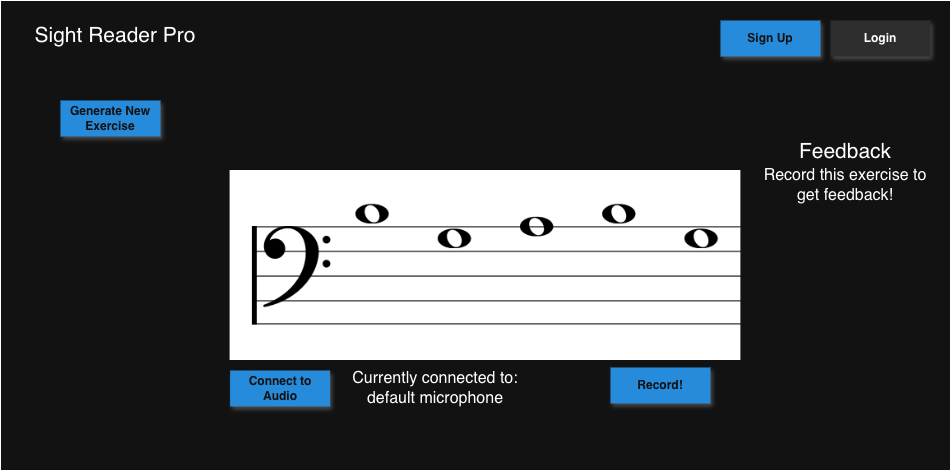
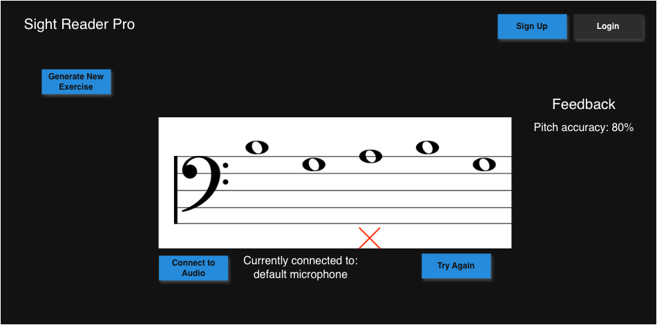
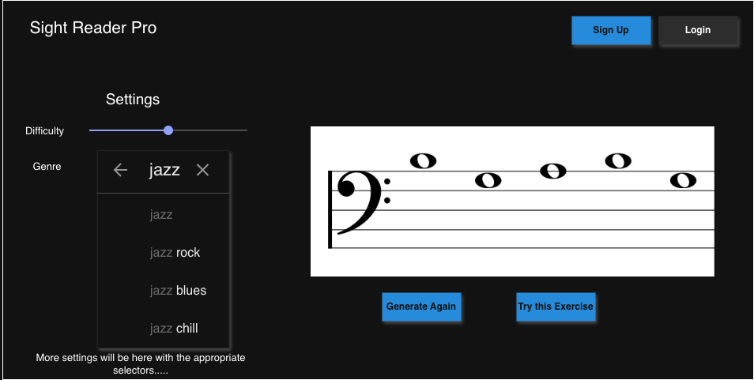
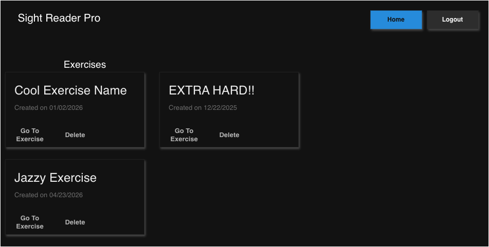
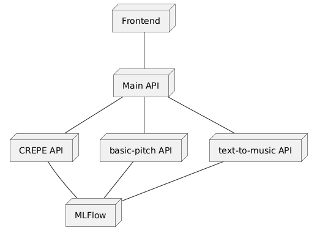

\newpage
This project code be found here: [https://github.com/tthoraldson/uol-final-project/](https://github.com/tthoraldson/uol-final-project/)

<!-- TODO: Add total word count to subtitle -->

# Introduction - X words

<!-- An introduction: this explains the project concept and motivation for the project (this can be based on your proposal). This must also state which project template you are using (max 1000 words). -->

_The template I am choosing is Artificial Intelligence Project Template 1: Orchestrating AI Models to Achieve a Goal._

In music, there is a concept called sight-reading. It involves being given a piece of sheet music and trying to play or sing it right away with little or no preparation. According to the National Association for Music Education, the ability to sight-read music has many benefits including increased confidence, stronger foundations in rhythm and pitch, and less stress when it comes to learning new music pieces [@empowering].

## An overview

"Sight Reading Pro", the name of this project, will be an application where users can practice and master sight-reading. Users will be able to use any instrument of their choosing, including voice, to practice their sight-reading abilities.

{width=300px}

Sight Reading Pro will be a web based application, utilizing various state of the art machine learning models to generate music passages for users to practice their sight-reading abilities. The user will get immediate feedback on attempts, including intonation (did they play the correct note?) and rhythm (did they play at the correct time?).

Users can choose whether they want to have an account or not. If they choose to have an account, they can keep track of all of the passages they've generated, and their recorded attempts and feedback on each passage.

Users with or without a login will be able to customize the complexity and difficulty of the generated passages using settings. Users will also be able to select between different styles of passages, such as classical or jazz.

## Why Would People Want This Project?

Personally, I've always wanted to get better at sight-reading but haven't found any existing products on the market that make me stick with working through exercises. The generated exercises are often boring, and only target one music area at a time (i.e. advance rhythms, chords, harmony, etc). Having the ability to customize the execrises, and adjusting them to meet my current music learning goals would be amazing.

The existing free projects on the market have limited instrument support, and have no way to track exercise history. The paid options are more focused on music education, instead of individual learning goals. The paid options are also out of reach to users that want to learn sight-reading, but don't have the budget to do so.

My goals for the project are to make a free, open source, individualized sight-reading platform that can work with any instrument.

## Existing/Similar Projects

### Sight Reading Factory

{width=300px}

Sight Reading Factory[@sighta] is a platform for sight-reading exercises mainly aimed towards educators. This platform supports ~30 instruments, and offers different difficulties of music passages to play. They offer generated music exercises for learners to practice with, getting feedback with each attempt at playing a passage.

#### Advantages

Sight Reading factory has a wide variety of features, including the ability to assess how well a user did on a given passage of music, and the ability to control how difficult generated passages are by limiting the note range, tempo, and rhythmic complexity. Sight Reading Factory supports both general audio/microphone input and MIDI.

Sight reading factory allows you to keep track of what passages you have generated, all of the sight-reading attempts you have made on a given passage, and it offers assessments on new blind passages. This product is the most robust with features that I have found.

#### Disadvantages

I believe the biggest disadvantage to Sight Reading Factory is the fact that it's a subscription, and starts at $45 per user per year. There's a free trial, but you have to enter credit card information in order to try it.

Sight Reading factory supports 30 instruments, but has no generic option if your instrument is not supported. You must log in to do anything, which can be just enough friction for learners that want to try sight -eading without committing to a product. This product is also heavily influenced by music educators, and a lot of the features are what you would expect to be in a classroom environment. For example, getting assigned passages to work on.

### sightreading.training

{width=300px}

sightreading.training[@sight] is a free and open source sight-reading platform. It offers sight-reading tools, and other tools for learning and playing music.

#### Advantages

sightreading.training supports MIDI, or allows the user to play on a piano that's in the browser. Having a virtual piano is a cool idea, as it makes sight-reading accessible to everyone, including those that don't have an instrument of their own. This website is also free, and you can get started practicing right away. Users have the ability to login and save settings for their sight-reading passages, but not the passages themselves.

#### Disadvantages

sightreading.training only supports MIDI and the virtual piano. If you have an instrument that you can't plug into your computer, you can't use this application. There are no settings to change rhythmic complexity. All of the notes have the same length.

# Literature Review - X words

<!-- TODO: Add Literature Review Word Count -->
<!-- this is a revised version of the chapter from your draft report, to include any further work you may have done since then, and to incorporate the feedback you have obtained from your submissions. (max 2500 words) -->

## Exploring Sight-Reading in Education

Understanding sight-reading, and how to improve this ability has been an area of study for over 100 years. One research study shows that aural-spatial skills (ear training) and technical proficiency skills were both essential to sight-reading[@hayward2009relationships].

In more recent times, a review was done on AI-education research related to music education. It concludes that "AI is under-utilized for generation despite its potential for education"[@carnovalini2025personalized]. The music generation part of the literature review goes deeper into music generation related to music exercises for general technical improvement.

## Pitch Estimation, Tempo Estimation, Audio Evaluation

There are lots of existing pre-trained models available that do different tasks related to music. This is an overview of the models I found most relevant to this project, and the models that I will test for usage in this project.

### CREPE

CREPE is a deep convolutional neural network that does pitch estimation [@kim2018crepe]. Given an audio file, such as a .wav or .mp3 file, CREPE will give a predicted frequency in hertz alongside a confidence score for every 10 milliseconds. Having a confidence interval allows for

There is also a demo of CREPE[@crepea] that runs fully in the browser using Tensorflow JS (tfjs)[@tensorflowjs]. It shows real time pitch estimation based on microphone input. In regards to this project, being able to have real time pitch estimation would allow for immediate feedback on a music passage.

### TempoCNN

TempoCNN[@schreiber2018singlestep] is a group of Convolutional Neural Network (CNN) models that estimate a given audio file's tempo, measured in beats per minute (BPM). These modes were trained on datasets that included mainly ballroom dancing music, and electronic dance music. This paper does note that there is a lack of various genres of music, including jazz, classical or reggae, and believes that the models would perform better if they had found and included this kind of data.

For my project "Sight Reader Pro", I believe TempoCNN is a good candidate model for being able to automatically detect the tempo that the user's recording was played at, and also use it for giving feedback on a given passage.

## Music Generation

### Basic Pitch

Basic Pitch[@bittner2022lightweight] is a model built by spotify that takes in an audio file (.wav or .mp3), and returns a MIDI file containing either the single pitch (one instrument/voice) or multi pitch (multiple instruments/voices/notes). Basic Pitch works in the realm of "Automatic Music Transcription", an area of research used to automatically create symbolic representations of music.

I believe Basic Pitch is a good candidate model that I can use to create backing tracks, and be able to have them stored as midi files. This way the project can take advantage of technologies such as WebMIDI[@2026web] for playback of a generated passage.

### MusicGEN

In "Simple and Controllable Music Generation", Meta AI describes a Language Model called MusicGEN[@copet2024simple]. MusicGEN is capable of taking a text based input, and generating a full song. This model can also be prompted with an existing melody and a text prompt, and output a song based on the original melody.

This series of models is promising for offering customized backing tracks for generated sight-reading exercises. The exercises could be tailored to include the correct genre of backing track.

While the music generated is really high quality, the models are also large and require a lot of compute. The smallest model in the MusicGEN model series contains 300 million parameters, and requires ~16gb of GPU RAM to run.

### NotaGen

NotaGen[@wang2025notagen] is a model that generates classical sheet music. The paper proposes a new "ClaMP-DPO" method for reinforcement learning, which increases musicality when compared to traditional human annotation or predefined rewards.

This model requires at least 8GB of GPU RAM to run the smallest model. One goal of "Sight Reader Pro" is to have low response times for any generative process. Because of the large compute requirements for NotaGEN, I don't believe it will be a good fit for the project.

### Text To Music

<!-- TODO: Add overview of text to music model -->

### Chat Musician

### Text2Midi

## The Research Gaps

<!-- TODO: Write about the lack of sight reading tools with these genrative tools -->

While there are

# Design - X words

<!-- TODO: Add design word count -->
<!-- this is a revised version of the relevant chapter from your draft report, again incorporating appropriate feedback and any changes you may have made to your design based on feedback given on previous submissions. (max 2000 words) -->

_As stated in the intro, the template I am choosing is Artificial Intelligence Project Template 1: Orchestrating AI Models to Achieve a Goal._

## Domain and Project Users

The goal of this project is to create a sight-reading web application that utilizes various machine learning models to create unique sight-reading exercises. The _target user_ for this project is an independent musician that's looking to improve their sight-reading abilities, and is interested in a customized experience based on their instrument of choice, skill level and music genre of choice. The _domain_ of this project could be considered to be music education, but I'm aiming for it to be specifically independent music education.

This project is not ideal for users just learning an instrument, as this application requires at least an elementary understanding of reading sheet music, and playing their instrument of choice.

## Design Overview

The designs below are what an minimum viable product for this project will look like. They have all of the bare minimum functionality, and nothing more.

### Home / Landing Page

{width=500px}

The home page will be a simple call to action to start practicing right now. The user can pick from generating another random exercise, or practice the one displayed right now. There will be no option to customize exercises from the home screen. If "practice now" is clicked, they will be taken to the main practice screen.

### Before Recording Exercise Attempt

{width=500px}

The exercise page before an attempt is very clean, only including two options: connect to an audio source and record an attempt. If the user selects the record, the record button will switch to a stop button. After the stop button is selected, the screen will update to the "after recording exercise attempt" screen. If the user doesn't have an audio source selected, they will not be able to record an attempt.

After I conduct more user interviews I will determine if there is a need for an audio upload option.

### After Recording Exercise Attempt

{width=500px}

This screen is extremely similar to the before exercise attempt screen, but with feedback added from the previous attempt. More feedback will be included based on settings selected, including tempo, rhythm accuracy, etc.

### Generate New Exercises

{width=500px}

In the mockup I have two settings to choose from, a difficulty slider and a genre selector. There will be more settings that I did not include in the mockup, such as:

- Tempo
- Key Signatures
- Melody Complexity (note type selectors)

### Exercise History

{width=500px}

This mockup shows the Exercise History screen. This screen has all of the exercises that the user has ever generated. The user has the ability to go to an exercise, or to delete it from the list. In this mockup I'm using cards to display each exercise that has been generated.

## Design Choices

<!-- TODO: Why did we make the choices we did? How will these choices best fufil the needs of the users? -->

## User Feedback

### Good experience with or without an account

My main goal is to reduce friction in users trying out Sight Reader Pro. All of the core functionality will be in the exercise page if a user is logged in or if they're anonymous.

### Customizable Exercise Settings

The settings to generate sight-reading exercises will allow users to generate exercises that are specific to them. For example, I only would want to see bass clef exercises that have a jazzy theme. Each user will be able to "choose their own adventure" for what kind of sight-reading experience they want.

# Implementation - X words

<!-- TODO: add word count -->
<!-- this should describe the implementation of the project. This should follow the style of the topic 6 peer review (but greatly expanded to cover the entire implementation), describing the major algorithms/techniques used, explanation of the most important parts of the code and a visual representation of the results (e.g. screenshots or graphs). (max 2500 words) -->

## Overview

## Docker

The whole project is wrapped in docker[@dockera]. The frontend, the main API, all of the models, and MLFlow[@mlflow] are all in their own containers.

{width=300px}

There are two defined networks: `frontend-network` and `model-network`. `frontend-network` has the frontend container and the Main API container. The goal of this network was to isolate what could talk to the Main API, and the Frontend. I didn't want any of the model containers being able to communicate to the frontend, and I didn't want the frontend or any external requests to be able to communicate with the model containers, or the MLFlow container.

Using docker allowed me to better control the dependencies for each model. For example, the `text-to-music model` uses python 3.12, whereas `basic-pitch model` uses python 3.10. These projects would not be able to run in the same container, as they both require different versions of Numpy[@numpy].

## Frontend

The frontend was written using React[@reactb] and uses Vite[@vite] for the docker/production build. I was already familiar with React, as I use it at my day job, and thought it would be the easiest way for me to make the frontend quickly.. The main styling and core components were built using React Bootstrap[@reacta].

## Main Backend API

## Model APIs

All of the model containers follow the same basic flow, using a version of python that meets the main package requirements, FastAPI for calling the model, and MLFlow for logging each experiment.

### Basic-Pitch API

### Text-To-Music API

### CREPE API

### User feedback

<!-- TODO: Talk about -->

# Evaluation - X words

<!-- TODO: add evaluation word length -->
<!-- Describe the evaluation carried out (e.g. user studies or testing on data) and give the results. You should also justify your choices in your approach to obtaining and analysing the results. Your evaluation should give a critique of the project as a whole, highlighting successes, failures, limitations and possible extensions. (max 2500 words) -->

## Model Evaluation

One of the core parts of choosing this project template was model evaluation. My main goals for choosing models were the following:

- Does this model have fast inference?

### MusicGen

- Kinda sucked. Took Forever.

### NotaGen

- Also kind of sucked.

### Text2Midi

- This model took forever.
- The model took ~2 hours to generate anything worth while.

### Text To Music

- Loved the results of this model
- Example code found on Huggingface hub/repo worked

## Failed Approaches

### Porting TextToMusic to ONNX Runtime

Earlier on in this project, I was playing around with the idea of using Transformers.js[@2026huggingface] to grab all of the models for this project, and have inference done using ONNX Runtime[@onnx]. This would allow me to run model inference on the client side, which would be so cool! The Transformers.js documentation made it seem like it would be easy enough, so I gave it a shot. The main python notebook (located at `project/model-exploration/text_to_music_onnx_conversion.ipynb` in the project repo[@thoraldson2026tthoraldson]) use to convert Text-To-Music to an onnx format seemed like it was going well, just running into typical input/output shape issues. I made it as far as uploading it to HuggingFace[@textToOnnx] before I realized running inference on this model required a custom python library, _Samplings_[@2022samplings]. For a few hours I tried to re-implement both the _TopPSampling_ and _TemperatureSampling_ methods before I decided to just use what the original author of the model had used, and go back to doing a full python implementaiton.

## Successes

### Basic-Pitch works great!

### CREPE + Basic-Pitch make a mean combo

## Limitations

## Extensions

# Conclusion - X words

<!-- TODO: add Conclusion word length -->
<!-- This can be a short summary of the project as a whole but, it can also bring out any broader themes you would like to discuss, or suggest further work. (max 1000 words) -->

## In Conclusion...

## If I were to do it again

If I were to start this project over, I believe my approach would change considerably. I think I probably would've stuck with using something like gradio[@abid2019gradio] or streamlit[@2021streamlit] to quickly make the frontend would've cut down my workload for getting a testable user interface, and allow me to put more time into prompt tuning the models I chose, and maybe even fine tuning models that would work better to generate sight-reading passages.

There were a lot of really cool audio processing libraries that I wanted to try, such as Librosa[@mcfee2015librosaa], but didn't get around to because of my approach. I believe that there are lots of signal processing implementations for audio analysis that I could've utilized if I wasn't so focused on using machine learning models for every aspect of this project.

## Further Work

\newpage

# Acknowledgements

- I'm grateful to my sister Anna, and my partner J for proof reading through this report too many times to count, and supporting me during stressful times.
- [Pandoc](https://pandoc.org/) was used to generate this report from a markdown file
- [Zotero](https://www.zotero.org/) was used to manage sources, and generate a BibTex file for references/citations
- [draw.io](https://www.drawio.com/) was used for all of the Sight Reader Pro mockups
- [https://plantuml.com/](https://plantuml.com/) was used for creating my architecture diagrams

# References
