\newpage

# Introduction - (720/1000 words)

<!-- An introduction: this explains the project concept and motivation for the project (this can be based on your proposal). This must also state which project template you are using (max 1000 words). -->

_The template I have chosen is Artificial Intelligence Project Template 1: Orchestrating AI Models to Achieve a Goal._

In music, there is a concept called sight-reading. It involves being given a piece of sheet music and trying to play or sing it right away with little or no preparation. According to the National Association for Music Education, the ability to sight-read music has many benefits including increased confidence, stronger foundations in rhythm and pitch, and less stress when it comes to learning new music pieces [@empowering].

## An overview

"Sight Reading Pro", is an application where users can practice and master sight-reading. Users can use any instrument of their choosing, including voice, to practice their sight-reading abilities.

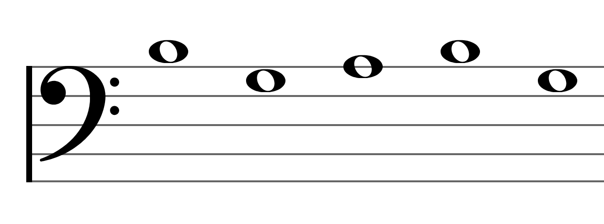{width=300px}

Sight reading pro is a web application along with multiple APIs, utilizing various state of the art machine learning models to generate music passages for users to practice their sight-reading abilities. The user gets

Users can customize the complexity and difficulty of the generated passages using settings. Users can also select between different styles of passages, such as classical or jazz.

## Why Would People Want This Project?

Personally, I've always wanted to get better at sight-reading but haven't found any existing products on the market that make me stick with working through exercises. The generated exercises are often boring, and only target one music area at a time (i.e. advance rhythms, chords, harmony, etc). Having the ability to customize the execrises, and adjusting them to meet my current music learning goals would be amazing.

The existing free projects on the market have limited instrument support, and have no way to track exercise history. The paid options are more focused on music education, instead of individual learning goals. The paid options are also out of reach to users that want to learn sight-reading, but don't have the budget to do so.

My goals for the project are to make a free, open source, individualized sight-reading platform that can work with any instrument.

## Existing/Similar Projects

### Sight Reading Factory

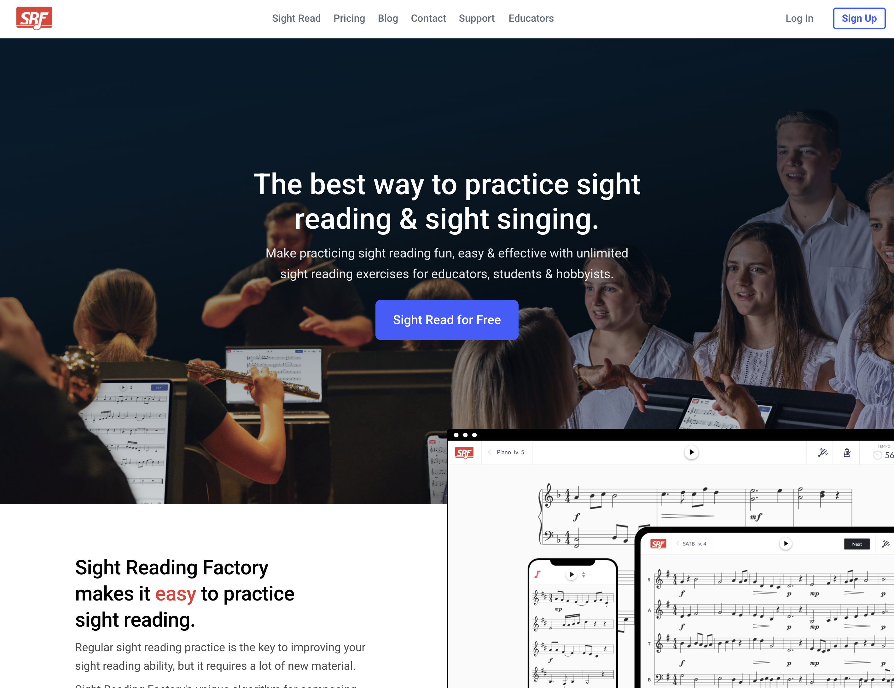{width=300px}

Sight Reading Factory[@sighta] is a platform for sight-reading exercises mainly aimed towards educators. This platform supports ~30 instruments, and offers different difficulties of music passages to play. They offer generated music exercises for learners to practice with, getting feedback with each attempt at playing a passage.

#### Advantages

Sight Reading factory has a wide variety of features, including the ability to assess how well a user did on a given passage of music, and the ability to control how difficult generated passages are by limiting the note range, tempo, and rhythmic complexity. Sight Reading Factory supports both general audio/microphone input and MIDI.

Sight reading factory allows you to keep track of what passages you have generated, all of the sight-reading attempts you have made on a given passage, and it offers assessments on new blind passages. This product is the most robust with features that I have found.

#### Disadvantages

I believe the biggest disadvantage to Sight Reading Factory is the fact that it's a subscription, and starts at $45 per user per year. There's a free trial, but you have to enter credit card information in order to try it.

Sight Reading factory supports 30 instruments, but has no generic option if your instrument is not supported. You must log in to do anything, which can be just enough friction for learners that want to try sight-reading without committing to a product. This product is also heavily influenced by music educators, and a lot of the features are what you would expect to be in a classroom environment. For example, getting assigned passages to work on.

### sightreading.training

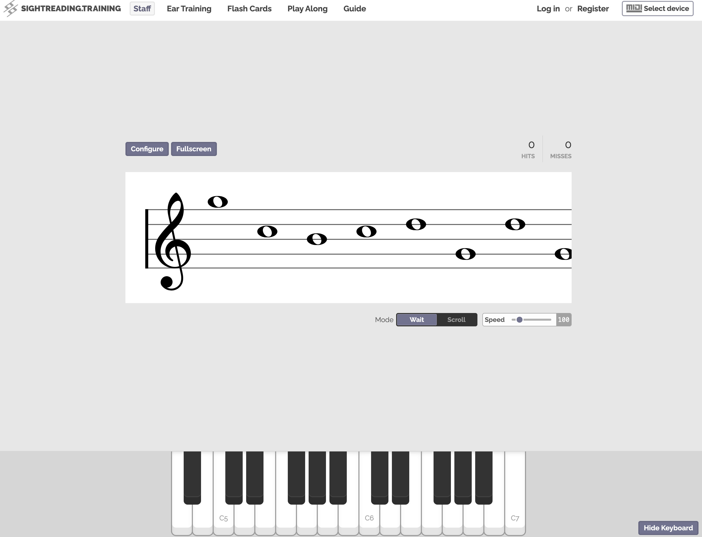{width=300px}

sightreading.training[@sight] is a free and open source sight-reading platform. It offers sight-reading tools, and other tools for learning and playing music.

#### Advantages

sightreading.training supports MIDI, or allows the user to play on a piano that's in the browser. Having a virtual piano is a cool idea, as it makes sight-reading accessible to everyone, including those that don't have an instrument of their own. This website is also free, and you can get started practicing right away. Users have the ability to login and save settings for their sight-reading passages, but not the passages themselves.

#### Disadvantages

sightreading.training only supports MIDI and the virtual piano. If you have an instrument that you can't plug into your computer, you can't use this application. There are no settings to change rhythmic complexity. All of the notes have the same length.

\newpage

# Literature Review (1903/2500 words)

<!-- TODO: Add Literature Review Word Count -->
<!-- this is a revised version of the chapter from your draft report, to include any further work you may have done since then, and to incorporate the feedback you have obtained from your submissions. (max 2500 words) -->

## Exploring Sight-Reading in Education

Understanding sight-reading, and how to improve this ability has been an area of study for over 100 years. One research study shows that aural-spatial skills (ear training) and technical proficiency skills were both essential to sight-reading[@hayward2009relationships].

In more recent times, a review was done on AI-education research related to music education. It concludes that "AI is under-utilized for generation despite its potential for education"[@carnovalini2025personalized]. The music generation part of the literature review goes deeper into music generation related to music exercises for general technical improvement.

## Pitch Estimation, Tempo Estimation, Audio Evaluation Models

There are lots of existing pre-trained models available that do different tasks related to music. This is an overview of the models I found most relevant to this project, including the models that I ended up using.

### CREPE

CREPE is a deep convolutional neural network that does pitch estimation [@kim2018crepe]. Given an audio file, such as a .wav or .mp3 file, CREPE will give a predicted frequency in hertz alongside a confidence score for every 10 milliseconds. Having a confidence interval allows for

There is also a demo of CREPE[@crepea] that runs fully in the browser using Tensorflow JS (tfjs)[@tensorflowjs]. It shows real time pitch estimation based on microphone input. In regards to this project, being able to have real time pitch estimation would allow for immediate feedback on a music passage.

### TempoCNN

TempoCNN[@schreiber2018singlestep] is a group of Convolutional Neural Network (CNN) models that estimate a given audio file's tempo, measured in beats per minute (BPM). These modes were trained on datasets that included mainly ballroom dancing music, and electronic dance music. This paper does note that there is a lack of various genres of music, including jazz, classical or reggae, and believes that the models would perform better if they had found and included this kind of data.

For my project I believe TempoCNN is a good candidate model for being able to automatically detect the tempo that the user's recording was played at, and also use it for giving feedback on a given passage.

## Music Generation

### Basic Pitch

Basic Pitch[@bittner2022lightweight] is a model built by spotify that takes in an audio file (.wav or .mp3), and returns a MIDI file containing either the single pitch (one instrument/voice) or multi pitch (multiple instruments/voices/notes). Basic Pitch works in the realm of "Automatic Music Transcription", an area of research used to automatically create symbolic representations of music.

I believe Basic Pitch is a good candidate model that I can use to create backing tracks, and be able to have them stored as midi files. This way the project can take advantage of technologies such as WebMIDI[@2026web] for playback of a generated passage.

### MusicGEN

MusicGEN[@copet2024simple] is capable of taking a text based input, and generating a full song. This model can also be prompted with an existing melody and a text prompt, and output a song based on the original melody.

This series of models is promising for offering customized backing tracks for generated sight-reading exercises. The exercises could be tailored to include the correct genre of backing track.

While the music generated is really high quality, the models are also large and require a lot of compute. The smallest model in the MusicGEN model series contains 300 million parameters, and requires ~16gb of GPU RAM to run.

### NotaGen

NotaGen[@wang2025notagen] is a model that generates classical sheet music. The paper proposes a new "ClaMP-DPO" method for reinforcement learning, which increases musicality when compared to traditional human annotation or predefined rewards. CLaMP 2[@wuclamp] is a multi-modal music information retriever that was trained across 101 languages. NotaGen uses CLaMP 2 in it's reinforcement learning ClaMPD-PO, where it takes the CLaMP model to do iterative optimization, and then DPO[@lewis2019bart].

This model requires at least 8GB of GPU RAM to run the smallest model. One goal of "Sight Reader Pro" is to have low response times for any generative process. Because of the large compute requirements for NotaGEN, I don't believe it will be a good fit for the project.

### Text To Music

_text-to-music_[@2022sanderwood] is a model that takes in a prompt, and produces ABC notation[@abc] from that prompt. It's a BART[@lewis2019bart] based model that has been finetuned with a dataset similar to wikimusictext[@2026sanderwood]. I find this to be one of the more compelling models, as the prompt examples contain the same kind of natural language that I'm looking to use in Sight Reader Pro:

```text
Example training prompts for text-to-music, directly
from model card on hugging face:

- This is a traditional Irish dance music. Note Length-1/8
  Meter-6/8 Key-D
- This is a jazz-swing lead sheet with chord and vocal.
```

I find the ability to use natural language to prompt for specific time signatures and music styles to fit perfectly with that I'm going to build with Sight Reader Pro. I also like that the output is in ABC format, which is just plain text. This makes it easy to store, and easy to process.

The training dataset used also contained the genre of music for each tune it was trained on, which is an important feature to have for when I generate prompts for creating new music.

### Chat Musician

Chat Musician[@yuan2024chatmusiciana] is a 4 billion paramter model based on LLAMA2[@touvron2023llama] that takes natural language prompts, and can do three tasks: Music Theory QA, Composing (using ABC notation[@abc]), and chatting. They created their own dataset, which they call _Music Pile_, that includes a variety of information outside of music including Wikipedia[@2025wikimedia], Irishman[@wutunesformer], and synthetic music data that they created using Chat-GPT 4[@openai2024gpt4]. The model performs extremely well on music understanding, music reasoning and music knowlege tasks. The paper talks about music generation as a way to compress music data into the ABC format for better compression, but doesn't talk about music generation as it's own goal.

### Text2Midi

Text2Midi[@text2midi] is an LLM that generates midi files from text descriptions. It takes LLM Embeddings from the text description, then uses a Transformer decoder to generate tokes that are then converted to a midi file.

MIDI[@2026midi] is a standard interface to define communication between instruments and a computer. MIDI can be live, like using a keyboard as a MIDI input, or MIDI can be a file format that's used to define the pitch, rhythm and tone of an instrument or an ensemble.

Using MIDI as a way to generate music seems like an interesting approach. There seems to be a handful of libraries that can handle MIDI to ABC notation and vice versa, but that doesn't seem to the the norm. I still want to experiment with generative MIDI models, as they have the potential to generate different music from the text to ABC style models listed above.

### MidiLLM

Similar to Text2Midi, MidiLLM[@wu2025midillm] is an LLM that produces MIDI. Text2Midi is based on Llama 3[@grattafiori2024llama]. It uses a two stage training process so that the model can understand text related to music, and also MIDI. MidiLLM outperforms Text2Midi on the TheoryTab dataset[@donahue2022melody], which specializes in multitrack music generation. This model is compatible with the HuggingFace Transformers library[@wolf2020transformers].

Considering my application is for sight-reading, which is a solo task, I don't believe using a model that specializes in creating MIDI for ensembles .

### AudioGen

AudioGen[@kreuk2023audiogen] is an auto-regressive generative model that creates audio samples based on text prompts. It was trained on a variety of different . The public model found on HuggingFace[@2023facebook] has 1.5 billion parameters.

One of my original ideas for Sight Reader Pro was to have the ability to create backing tracks for the generated sight-reading exercises. While I could also generate midi for this task, having more realistic audio that sounds like a real guitar, or a reach orchestra seems appealing.

My main worry with this model, similar to MusicGen[@copet2024simple], is that it's too large, and too computationally expensive to use alongside simple, ABC notation based sight reading exercises. It would be cool to incorporate something like this into a base set of exercises on Sight Reading Pro in the future, where the ABC and backing track are already generated, but this will not work for on the fly sight-reading exercise generation.

## Other Models

### Qwen, Qwen ONNX

Qwen3[@yang2025qwen3] is an open source LLM, and is a popular alternative to both Chat GPT and Claude. It can

On HuggingFace, there's an ONNX Runtime[@onnx] implementation of Qwen3[@onnxcommunity], having 0.6 billion parameters. ONNX Runtime can run models both on mobile devices and directly in the browser. Having a cross-platform compatible model for any conversation or retrival tasks could be nice! And using something like TensorflowJS[@tensorflowjs] or TransformersJS[@2026huggingface] to run Qwen 3 directly in the browser is appealing.

I believe this would be more of a stretch feature than anything I would include in this iteration of Sight Reader Pro.

### Llama

Llama 2[@touvron2023llama] and Llama 3[@grattafiori2024llama] are a series of LLMs put out by Meta. As listed above, they're commonly used as base models for building fine tuned and task specific models. The Llama series is great at typical LLM tasks like conversation and retrival (Just like Qwen!).

Similar to Qwen 3, using a Llama model directly is a stetch feature.

## Libraries

### Librosa

Librosa[@mcfee2015librosa] is a python library that has lots of audio processing functions. It offers pre-made models for tasks like onset detection, rhythm features, pitch and tuning, onset detection, and much more.

I plan on using librosa to validate the results of some of the larger models I'll be using. Librosa can handle beat tracking and tempo related tasks, and it also has an implementation of PyiN[@mauch2014pyin], a frequency estimator does the same task as CREPE[@crepeb], as mentioned aboce.

### music21

"music21[@what] is a Python-based toolkit for computer-aided musicology." It has tons of helper methods to convert between common types (abc -> midi), It has has a large corpus of various free music in different formats for testing. I believe this library will be helpful for quickly converting between music formats, and maybe finding some testing data.

### muspy

muspy[@dong2020muspy][@muspy] is library mainly focused on creating music analysis related pipelines, and facilitating music i/o between other popular music formats and libraries. It supports both ABC notation[@abc] and MIDI, along with many more. It also has it's own set of muspy specific classes, focused on symbolic music representation.

This library will be helpful if I want to explore storing the sight-reading exercises in a more symbolic way, and it could also be helpful for it's music i/o functions

### mir_eval

mir_eval[@raffeltransparent][@mir_evala] describes itself as " Python library which provides a transparent, standardized, and straightforward way to evaluate Music Information Retrieval systems." It has tons of methods specifically for Music Information Retrival, including tempo validation, key detection, and segmentation.

This library will be extremely useful in helping to evauluate how well my selected models perform, and to calculate metrics for users sight-reading exercise attempts.

## The Research Gaps

While there are many _text-to-music_ machine learning models that satisfy generating new sight-reading exercises, there is a lack of applications that put it to use in real time. There is also a lack of using the AMT style tools and models to produce feedback on sight reading exercises. The two main solutions (Sight Reading Factory[@sighta] and sightreading.training[@sight]) don't have the ability to customize exercises based on genre, or any prompt for that matter.

\newpage

# Design - (926/2000 words)

<!-- this is a revised version of the relevant chapter from your draft report, again incorporating appropriate feedback and any changes you may have made to your design based on feedback given on previous submissions. (max 2000 words) -->

_As stated in the intro, the template I am choosing is Artificial Intelligence Project Template 1: Orchestrating AI Models to Achieve a Goal._

## Domain and Project Users

The goal of this project was to create a sight-reading web application that utilizes various machine learning models to create unique sight-reading exercises. The _target user_ for this project is an independent musician that's looking to improve their sight-reading abilities, and is interested in a customized experience based on their instrument of choice, skill level and music genre of choice. The _domain_ of this project could be considered to be music education, but I'm aiming for it to be specifically independent music education.

This project is not ideal for users just learning an instrument, as this application requires at least an elementary understanding of reading sheet music, and playing their instrument of choice.

In my initial feedback survey on the mockups, there was almost an even split of people who were musicians, and people who were not. I believe this is the best kind of feedback, as I can iterate on my feeatures to work for everyone who may want to try sight-reading, not just the experts.

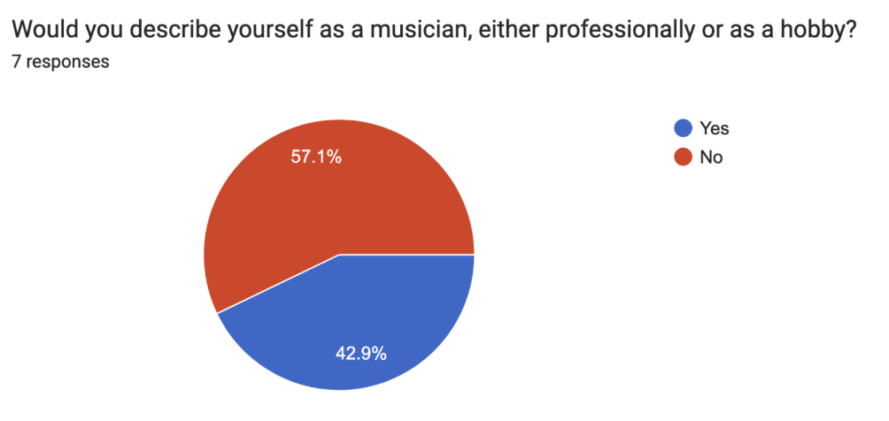{width=400px}

I also asked if users were familiar with the concept of sight-reading. Surprisingly, the majority did! I believe this validates the name, _Sight Reader Pro_, as something that could be recognizable.

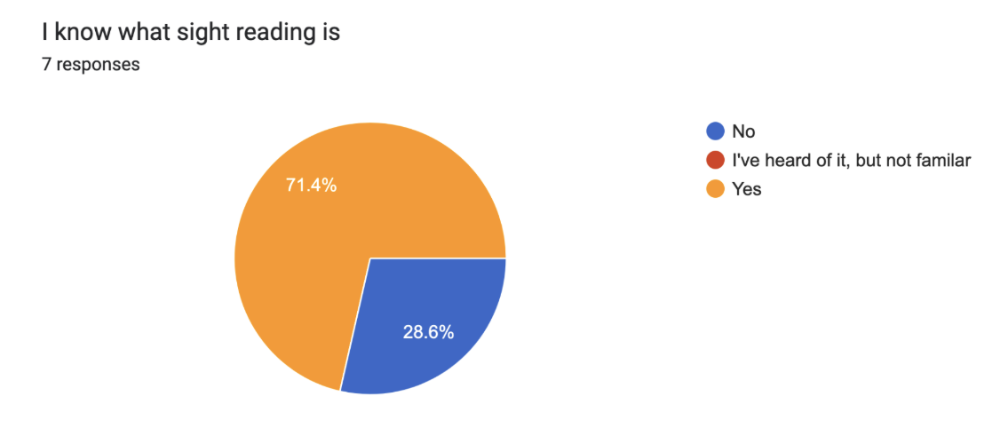{width=400px}

## Design Overview

The designs below are both my initial mockups for what Sight Reader Pro might look like, and the final version.

### Home Page

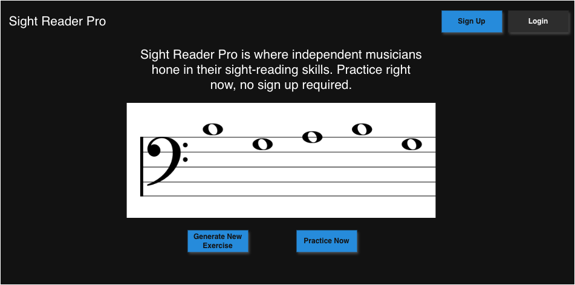{width=500px}

In the inital mockup phase, I was planning on implementing a home page that had the majority of the functionality of the exercise page, but with some marketing flare for first time visitors. After I got into implementing the app, I decided to ax creating a different home page. The exercise page is the only page, and all of the functionality of the final Sight Reading Pro happens there.

{width=500px}

### Before Recording Exercise Attempt

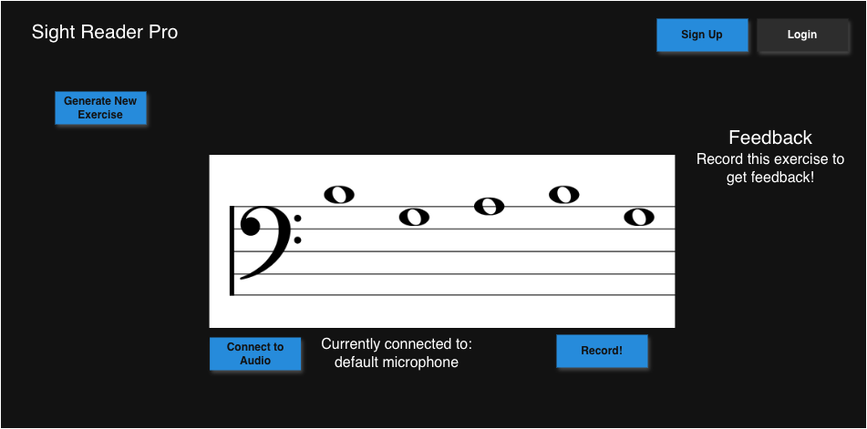{width=500px}

The mockup exercise page before an attempt is very clean, only including two options: connect to an audio source and record an attempt. If the user selects the record, the record button will switch to a stop button. After the stop button is selected, the screen will update to the "after recording exercise attempt" screen. In this mockup, there was no option to upload audio.

#### User Feedback

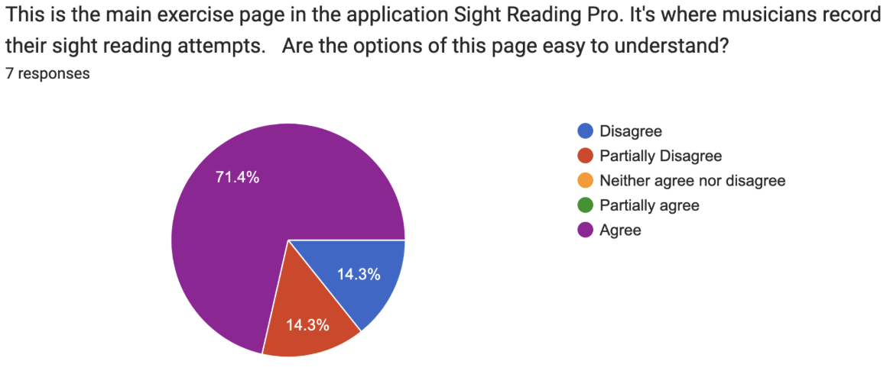{width=500px}

The majority of the users surveyed agreed that the options of this page were easy to understand. There was no freeform feedback on this screen.

#### Final Design

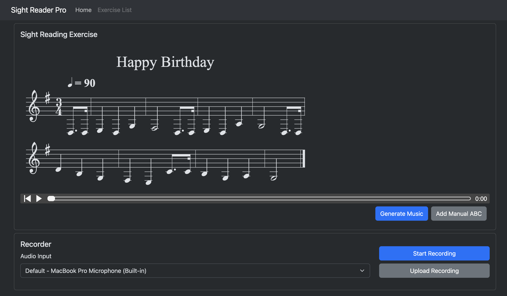{width=500px}

The final design ended up adding a few new things. There is a midi playback, that's part of the ABCJS[@abcjs] package, and creates a playback of what the exercise sounds like. Considering how easy this feature was to add (It was two lines in the frontend), I thought it would be worth adding in.

The second new feature on this view is the ability to add ABC notation manually. This feature became important for full-stack testing towards the end of creating this project. The music that was being generated was too difficult for me to play, and I wanted to be able to test the same exercise repeatedly after the state of the application had changed.

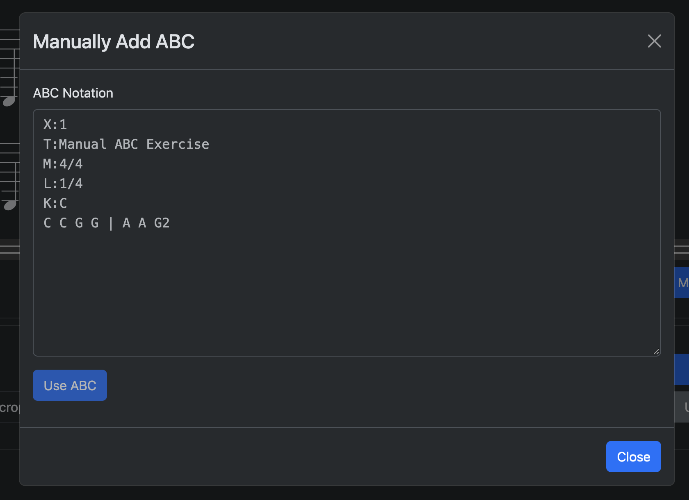{width=500px}

The third feature was one that I talked about in my preliminary report: the ability to upload audio directly to the frontend. This feature has been extremely nice for testing, but I think users might find it helpful too. For example, recording audio on your phone, and then uploading it to Sight Reader Pro when you get home.

### After Recording Exercise Attempt

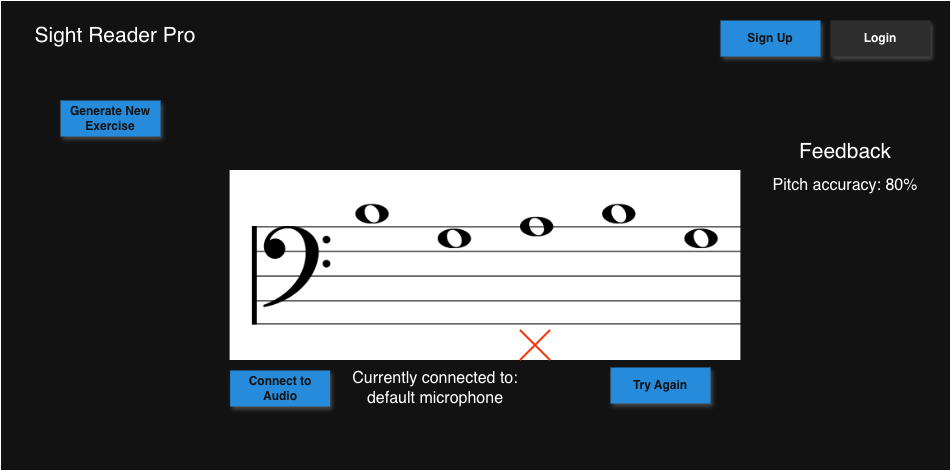{width=500px}

This screen is extremely similar to the before exercise attempt screen, but with feedback added from the previous attempt. More feedback will be included based on settings selected, including tempo, rhythm accuracy, etc.

#### User Feedback

The main feedback I got back from users is that the initial mockup was slightly confusing. They didn't know what the red "X" under the note signified. Users suggested turning the whole note red, and updating the button heirarchy was clear.

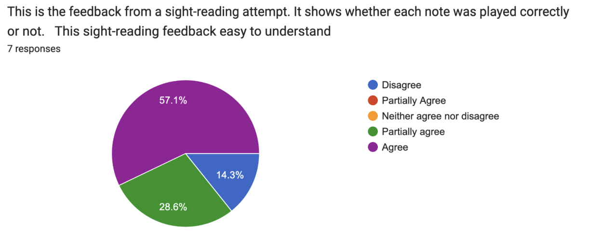{width=500px}

#### Final Design

The final design took the user feedback to heart, and implemented both colored note nighlighting for the notes the user missed, and updated buttons that are color coordinated.

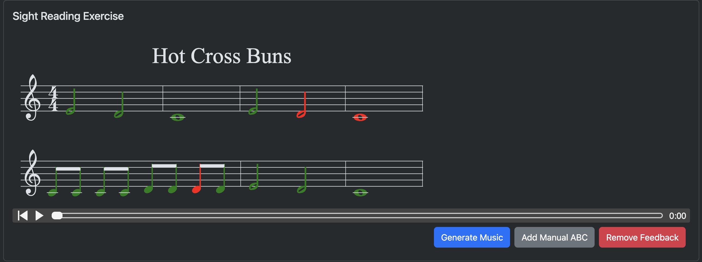{width=500px}

### Generate New Exercises

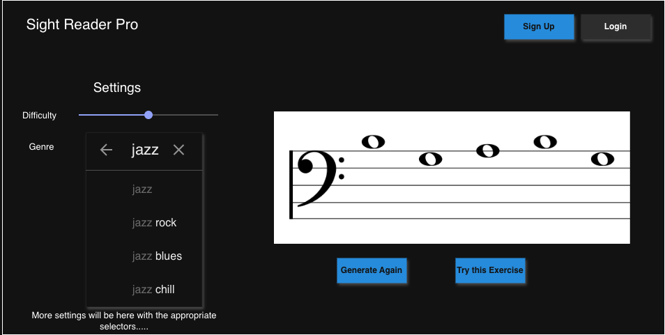{width=400px}

In the mockup I have two settings to choose from, a difficulty slider and a genre selector. I envisioned many more settings, but only ended up adding support to select from a list of common instruments.

#### User Feedback

The majority of the users agreed that the initial design gave them all the information they need to select an exercise. There was no freeform feedback.

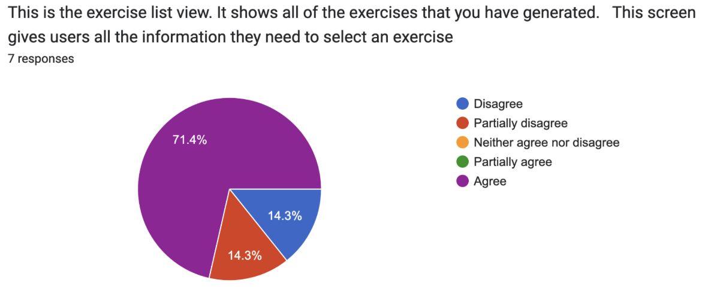{width=500px}

#### Final Design

Since the users liked the inital form, I didn't change it much. I moved the difficult slider to a dropdown, as prompting with a difficulty number is challenging, and added the option to select an instrument.

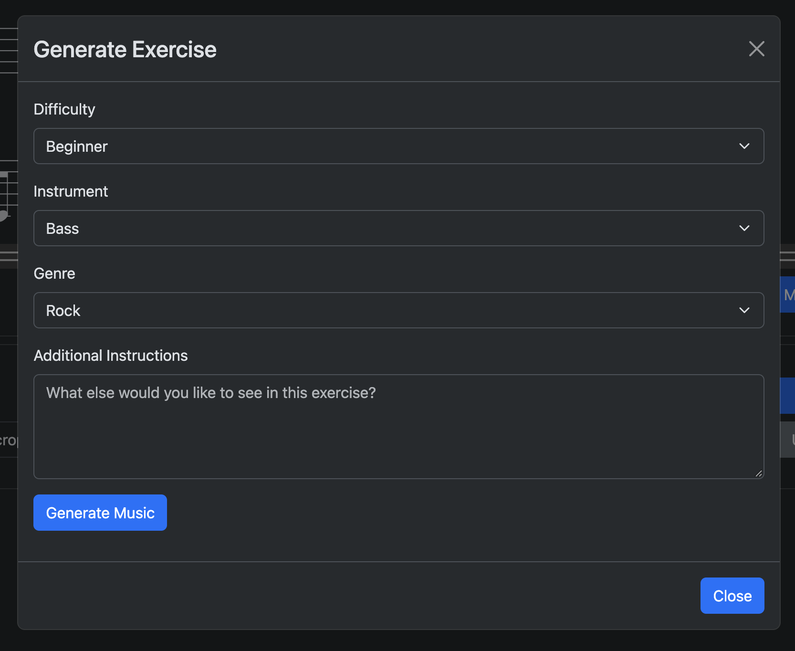{width=400px}

## Design Choices

### Keep it simple

Considering the complexity that's required to generate sight-reading music, and then analyze it, I wanted to keep the frontend web application as simple as possible. There is some customizability, but the core features simple and intuitive.

### Good experience without needing a login

My main goal is to reduce friction in users trying out Sight Reader Pro. All of the core functionality will be in the exercise page, which requires no login. Any person that stumbles across the app can use it right away.

### Customizable Exercise Settings

The settings to generate sight-reading exercises will allow users to generate exercises that are specific to them. For example, I only would want to see bass exercises that have a jazz theme. Each user will be able to "choose their own adventure" for what kind of sight-reading experience they want.

\newpage

# Implementation (1653/2500 words)

<!-- TODO: add word count -->
<!-- this should describe the implementation of the project. This should follow the style of the topic 6 peer review (but greatly expanded to cover the entire implementation), describing the major algorithms/techniques used, explanation of the most important parts of the code and a visual representation of the results (e.g. screenshots or graphs). (max 2500 words) -->

## Docker

The whole project is wrapped in docker[@dockera]. The frontend, the main API, all of the models, and MLFlow[@mlflow] are all in their own containers.

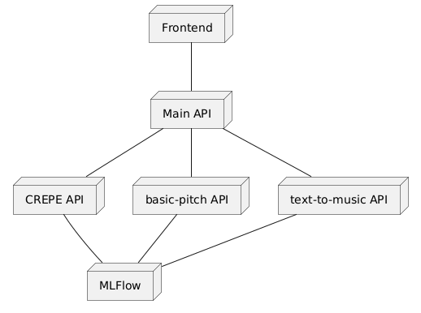{width=300px}

There are two defined networks: `frontend-network` and `model-network`. `frontend-network` has the frontend container and the Main API container. The goal of this network was to isolate what could talk to the Main API, and the Frontend. I didn't want any of the model containers being able to communicate to the frontend, and I didn't want the frontend or any external requests to be able to communicate with the model containers, or the MLFlow container.

Using docker allowed me to better control the dependencies for each model. For example, the `text-to-music model` uses python 3.12, whereas `basic-pitch model` uses python 3.10. These projects would not be able to run in the same container, as they both require different versions of Numpy[@numpy]. It also allowed me to experiment with different libraries for analysis, such as music21 and librosa. Being able to destroy a container that didn't work out and spin a new one up was amazing.

## Docker Compose

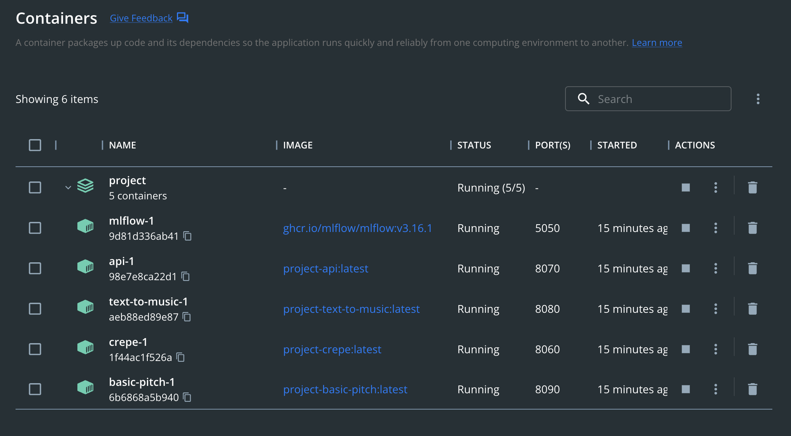{width=400px}

In the main `/project` directory in my github repository[@thoraldson2026tthoraldson], there's my docker-compose. This file controls almost everything about the backend projects, and how they interact with each other.

This is how `basic-pitch` is configured in the `docker-compose.yml` file:

```yml
basic-pitch:
  build:
    context: ./backend/basic-pitch
  networks:
    - model-network
  ports:
    - "8090:8090"
  env_file:
    - .env
```

`basic-pitch` runs on my local port `8090`, and I'm able to pass in secrets and environmental variables into the container without having to declare them over and over, as I use them in all the containers.

### Example

Lets say I just made a change in `api` and `basic-pitch`. I can rebuild only those containers and spin them up with just two commands:

```bash
docker compose build api basic-pitch
docker compose up api basic-pitch crepe
```

### Run all projects

To run all of the containers in the `docker-compose.yml` file, simply run this from inside of the `/project` directory:

```bash
docker compose up
```

## Frontend

### Libraries Used

The frontend was written using React[@reactb] and uses Vite[@vite] for the docker/production build. I was already familiar with React, as I use it at my day job, and thought it would be the easiest way for me to make the frontend quickly.. The main styling and core components were built using React Bootstrap[@reacta]. I used abcjs[@abcjs] for rendering abc notation, and for creating the MIDI playback for the displayed exercise.

### structure

```text
- api/
- components/
- pages/
- public/
- App.tsx
- index.tsx
```

#### api

contains methods for calling the main `api` project. It forces the exact request types and responses that will be coming from each endpoint.

#### components

contains all of the components that make up the application. Examples include:

- `<Navigation /`>: The navigation bar at the top of the page.
- `<Recorder />`: Handles all of the audio input into the app. Select an audio device, upload audio, and the button to analyze the audio
- `<Music />`: Renders ABC Notation, renders feedback from the analyze function, and has the generated audio playback functionality
- `<MusicContext />`: Stores the current abc string, and feedback array. Is used in other components that need to access or modify abc/feedback.
- _Modals_ Both the _Manual ABC Creation Modal_ and the _Generate Music Modal_ popups
- _Forms_ The forms that are displayed in the modals

#### pages

There's only one file in here, and that's `home.tsx`. This file holds all of the core components needed to render the page.

#### public

Contains only `vmsg.wasm`, the Web Assembly[@webassembly] binary required for the `vmsg` package to work. `vmsg` ensures that the recordings sent to the backend are in `.mp3 format`, an issue that caused me many hours of lost time!!

#### `app.tsx`

Hosts the main wrapper for the application, including the `<Navigation/ >`, and the `<Music />`

#### `index.tsx / index.html`

The default landing page, and the entry point into the whole application.

#### other

The `package.json` and `package-lock.json` are in `src`. There are also a few helper files, such as `eslint.config.ts`, which ensures formatting and linting happens each time I save a file. There's also vite testing configuration files, that currently do _Nothing!_ as I didn't get to any frontend unit testing.

I decided to use TypeScript[@typescript] so that all of the components could have strong typing. This makes it much easier when using shared methods, as the TypeScript compiler will freak out if anything is left untyped.

This app has the same structure as the other docker files, but it doesn't currently work in the docker container. It's on my list of future TODOs!

## Main Backend API

This is the API that communicates with the frontend, and with all of the model containers. The backend api also handles the main analysis function for

### dependencies

The backend API has a few packages that are different from the model container, including `httpx` to make async requests to the other models, music analysis and utility libraries `librosa`, `pretty_midi`, `mir_eval`, `muspy` and `music21`.

### Routers

There are routers for each of the model containers:

- `basic_pitch.py`
- `crepe.py`
- `music_to_text.py`
- `utilities.py`
  - Used to create visualizations
  - As of writitng this report, it has the method to create an image from the `MIDI` file returned from `basic-pitch`

All of the routes use `httpx` to make requests to the model APIs. The majority of them are simple build request, wait for response, return response kind of files.

### `main.py`

Contains the main logic to startup a `FastAPI`[@fastapi] server, and add all of the routers to it.

It has two routes: a `hello world` route, and the `analyze` route. The analyze route handles processing the user's submitted audio file, and sends it to the `analyze` component.

Also has all wildcard `CORS` policy, which is not great, but it allows me to debug locally efficently! This needs to be removed if this app ever gets deployed.

### Components

#### abc_utils.py

A few helper functions to help validate and parse the ABC Notation strings that are returned from `music-to-text`.

The `ensure_default_note_length` method adds a normally missing property back into ABC strings. The `abc_to_midi` method uses `music21` to generate a baseline MIDI file to be used to compare against what basic_pitch creates. I'm not happy with this method, and it's on my list of things to fix.

#### analyze.py

Contains `analyze_v1`, which curently uses `mir_eval` to match notes in the _baseline MIDI_ and the _basic-pitch generated midi_.

Results from crepe are passed in to `mir_eval` for finding the estimated tempo, and to compare against the _baseline MIDI_.

`analyze_v1` works just okay. It doesn't do well with complex rhythm, or fast, muddy recordings. I plan on implementing an `analyze_v2` with another attempt.

## Model APIs

All of the model containers follow the same basic flow, using a version of python that meets the main package requirements, FastAPI for calling the model, and MLFlow for logging each experiment.

Each of the model containers has its own python runtime, its own set of dependencies,

### Basic-Pitch API

#### The base container

The basic-pitch documentation recommends `python 10` for running the model. The basic-pitch model gets downloaded directly into the container using this line:

```bash
RUN apt-get update && apt-get install -y curl && \
    curl -L https://github.com/spotify/basic-pitch/raw/refs/heads/main/
    basic_pitch/saved_models/icassp_2022/nmp.onnx -o ./nmp.onnx
```

I chose to use the onnx model, as it was the model that required the least amount of dependencies.

#### The API

Aside from the hello world endpoint, there's the `/midi` endpoint which does all logic for running basic pitch. `/midi` expects the audio file that it's going to convert.

Before any conversion begins, an _MLFlow_ experiment is started, and logs all of the parameters.

### Text-To-Music API

#### The base container

This container needed quite a few special packages to make the _text-to-music_ model work:

- `libffi-dev`
- `package-config`
- `libssl-dev`

It also installs rust[@rust], which is needed for torch[@pytorch] to work.

#### The API

Only one endpoint aside from a hello world, which is `/generate`. It takes in the prompt that was generated on the frontend (based on what the user put in the generate exercise form), and runs inference on the `text-to-music` model.

MLFlow experiment tracking is enabled for each inference run, so I can keep track my my different hyperparameters I've used on this model.

#### `text-to-music` Inference

Based on the _text-to-music_ model card[@2022sanderwood], the `samplings` library is used to sample `top_p_sampling` and `temperature_sampling`. I attempted to use a normal HuggingFace transformers[@wolf2020transformers] generate method, but no valid ABC notation came out of it.

For now, this weird inference setup stays. I want to try and make it more efficient.

### CREPE API

#### The base container

_CREPE_ demanded a very specific version of setup tools in order to compile. I added a `pip install setuptools<81` command inside of the docker container before the normal `requirements.txt` were installed.

_CREPE_ uses Tensorflow[@tensorflow] to load the model and run inference.

#### The API

There is one main method, `/pitch-tracker` that calls CREPE with the default parameters that were in the example starter code, because the defaults work great! It then returns the predictions that CREPE generates.

There's also `/pitch-tracker-image`, which produces an activation plot based on the predictions. The code that generates the image is from the crepe repository, because it was not included in the CREPE `pip` package. This is only used for testing purposes, and is not callable from the frontend.

### MLFlow

MLFlow[@mlflow] is an experiment tracker for machine learning models. It can track hyperparameters, and metrics about the container it's running in.

I use the results from MLFlow container in the _Evaluation_ part of this report.

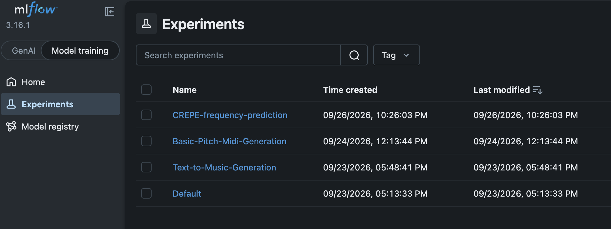{width=400px}

## At a high level

There are two main actions that a user of Sight Reader Pro does:

- Generate sight-reading exercises
- Analyze sight-reading exercises

The following picture shows the major API calls that happen between the containers to create exercises and analyze audio:

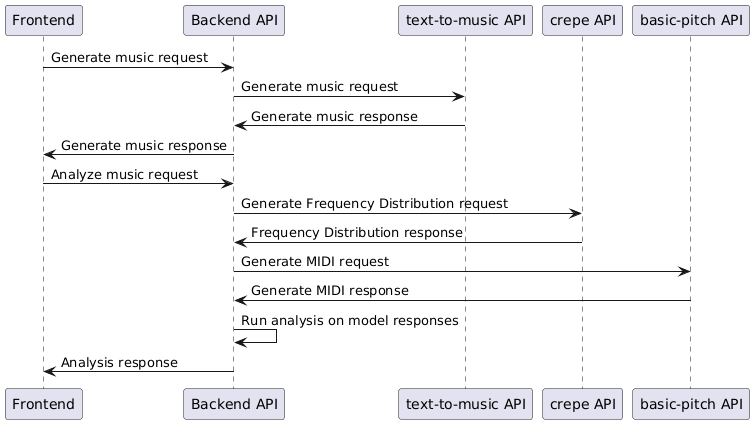{width=500px}

# Evaluation (X/2500 words)

<!-- Describe the evaluation carried out (e.g. user studies or testing on data) and give the results. You should also justify your choices in your approach to obtaining and analysing the results. Your evaluation should give a critique of the project as a whole, highlighting successes, failures, limitations and possible extensions. (max 2500 words) -->

## Model Evaluation

One of the core parts of choosing this project template was model evaluation. My main goals for choosing models were the following:

- Does this model have fast inference?
- Can the model generate a variety of music styles?
- Can the model

### Chat Musician

- Also kind of sucked.

### Text2Midi

_notebook for my exploration is at `project/model_exploration/text2midi.ipynb`_

This is the only text-to-midi model that I tried. It took almost 2 hours to run inference in a google colab space. There were some issues with the example code that I tried causing an error when trying to run the decoder and create the midi file.

The inference time and the amount of compute made me say no to this model.

### Text To Music

- Loved the results of this model
- Example code found on Huggingface hub/repo worked

<!-- IMAGE OF INFERANCE FROM LAST 10 RUNS -->
<!--  -->

## Selected Models

## Failed Approaches

### Porting TextToMusic to ONNX Runtime

Earlier on in this project, I was playing around with the idea of using Transformers.js[@2026huggingface] to grab all of the models for this project, and have inference done using ONNX Runtime[@onnx]. This would allow me to run model inference on the client side, which would be so cool! The Transformers.js documentation made it seem like it would be easy enough, so I gave it a shot. The main python notebook (located at `project/model-exploration/text_to_music_onnx_conversion.ipynb` in the project repo[@thoraldson2026tthoraldson]) use to convert Text-To-Music to an onnx format seemed like it was going well, just running into typical input/output shape issues. I made it as far as uploading it to HuggingFace[@textToOnnx] before I realized running inference on this model required a custom python library, _Samplings_[@2022samplings]. For a few hours I tried to re-implement both the _TopPSampling_ and _TemperatureSampling_ methods before I decided to just use what the original author of the model had used, and go back to doing a full python implementaiton.

## Successes

### Basic-Pitch works great!

### CREPE + Basic-Pitch make a mean combo

{width=500px}

## Limitations

## Extensions

# Conclusion (X/1000 words)

<!-- TODO: add Conclusion word length -->
<!-- This can be a short summary of the project as a whole but, it can also bring out any broader themes you would like to discuss, or suggest further work. (max 1000 words) -->

## In Conclusion...

## If I were to do it again

If I were to start this project over, I believe my approach would change considerably. I think I probably would've stuck with using something like gradio[@abid2019gradio] or streamlit[@2021streamlit] to quickly make the frontend would've cut down my workload for getting a testable user interface, and allow me to put more time into prompt tuning the models I chose, and maybe even fine tuning models that would work better to generate sight-reading passages.

There were a lot of really cool audio processing libraries that I wanted to try, such as Librosa[@mcfee2015librosaa], but didn't get around to because of my approach. I believe that there are lots of signal processing implementations for audio analysis that I could've utilized if I wasn't so focused on using machine learning models for every aspect of this project.

## Further Work

\newpage

# Acknowledgements

- I'm grateful to my sister Anna, and my partner J for proof reading through this report too many times to count, and supporting me during stressful times.
- [Pandoc](https://pandoc.org/) was used to generate this report from a markdown file
- [Zotero](https://www.zotero.org/) was used to manage sources, and generate a BibTex file for references/citations
- [draw.io](https://www.drawio.com/) was used for all of the Sight Reader Pro mockups
- [https://plantuml.com/](https://plantuml.com/) was used for creating my architecture diagrams

# References
