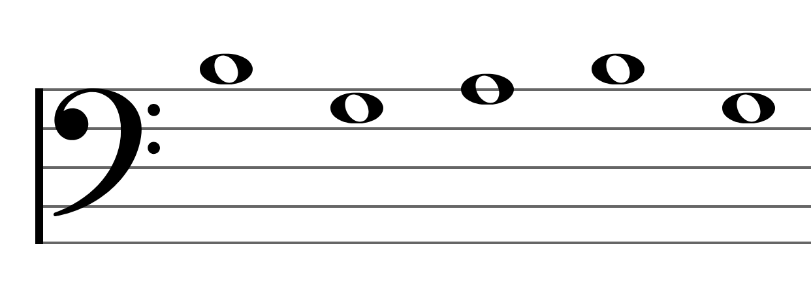
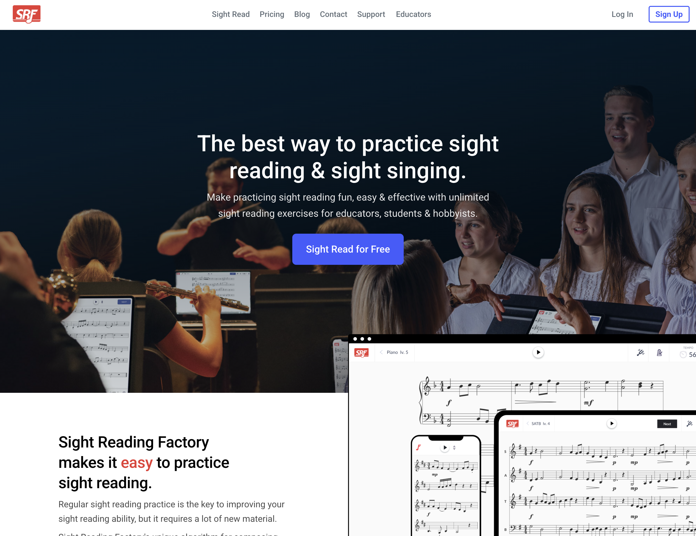
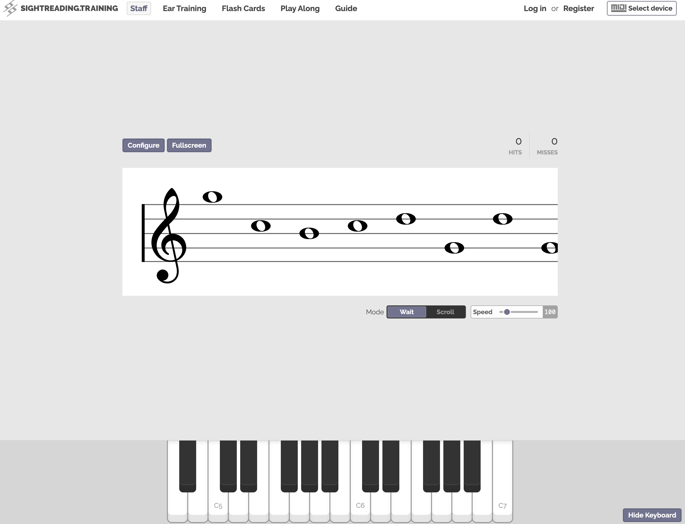
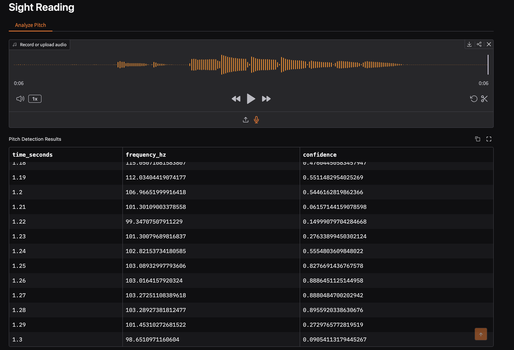
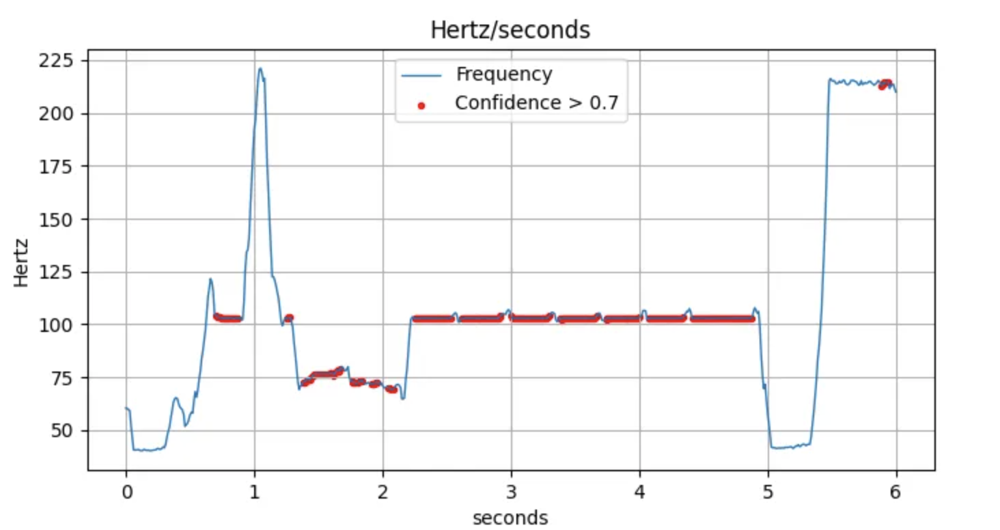
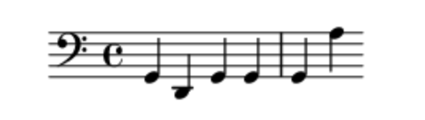

# Introduction
<!-- An introduction: this explains the project concept and motivation for the project (this can be based on your proposal). This must also state which project template you are using (max 1000 words). -->

*The template I am choosing is Artificial Intelligence Project Template 1: Orchestrating AI Models to Achieve a Goal.*

In music, there is a concept called sight reading. It involves being given a piece of sheet music and trying to play it or sing it right away with little or no preparation. According to the National Association for Music Education, the ability to sight read music has many benefits including increased confidence, stronger foundations in rhythm and pitch, and less stress when it comes to learning new music pieces [@empowering].

## An overview

"Sight Reading Pro", the name of this project, will be an application where users can practice and master sight reading. Users will be able to use any instrument of their choosing, including voice, to practice their sight reading abilities.

{width=300px}

Sight Reading Pro will be a web based application, utilizing various state of the art machine learning models to generate music passages for users to practice their sight reading abilities. The user will get immediate feedback on attempts, including intonation (did they play the correct note?) and rhythm (did they play at the correct time?).

Users can choose whether they want to have an account or not. If they choose to have an account, they can keep track of all of the passages they've generated, and their recorded attemps and feedback on each passage.

Users with or without a login will be able to customize the complexity and difficulty of the generated passages using settings. Users will also be able to select between different styles of passages, such as classical or jazz.

## Why Would People Want This Project?

For me personally, I've always wanted to get better at sight reading but haven't found any existing products on the market that make me stick with working through exercises. The generated exercises are often boring, and only target one music area at a time (i.e. advance rhythms, chords, harmony, etc).

The existing free projects on the market have limited instrument support, and have no way to track exercise history. The paid options are more focused on music education, instead of individual learning goals. The paid options are also out of reach to users that want to learn sight reading, but don't have the budget to do so.

My goals for the project are to make a free, individualized sight reading platform that can work with any instrument.

## Existing/Similar Projects

### Sight Reading Factory

{width=300px}

Sight Reading Factory[@sighta] is a platform for sight reading exercises mainly aimed towards educators. This platform supports ~30 instruments, and offers different difficulties of music passages to play. They offer generated music exercises for learners to practice with, getting feedback with each attempt at playing a passage.

#### Advantages

Sight Reading factory has a wide variety of features, including the ability to assess how well a user did on a given passage of music, and the ability to control how difficult generated passages are by limiting the note range, tempo, and rhythmic complixty. Sight Reading Factory supports both general audio/microphone input and MIDI. 

Sight reading factory allows you to keep track of what passages you have generated, all of the sight reading attempts you have made on a given passage, and it offers assessments on new blind passages. This product is the most robust with features that I have found.

#### Disadvantages

I believe the biggest disadvantage to Sight Reading Factory is the fact that it's a subscription, and starts at $45 per user per year. There's a free trial, but you have to enter credit card information in order to try it. 

Sight Reading factory supports 30 instruments, but has no generic option if your instrument is not supported. You must log in to do anything, which can be just enough friction for learners that want to try sight reading without committing to a product. This product is also heavily influenced by music educators, and a lot of the features are what you would expect to be in a classroom environment. For example, getting assigned passages to work on.

### sightreading.training

{width=300px}

sightreading.training[@sight] is a free and open source sight reading platform. It offers sight reading tools, and other tools for learning and playing music. 

#### Advantages

sightreading.training supports MIDI, or allows the user to play on a piano that's in the browser. Having a virtual piano is a cool idea, as it makes sight reading accessible to everyone, including those that don't have an instrument of their own. This webiste is also free, and you can get started practicing right away. Users have the ability to login and save settings for their sight reading passages, but not the passages themselves.

#### Disadvantages

sightreading.training only supports MIDI and the virtual piano. If you have an instrument that you can't plug into your computer, you can't use this application. There are no settings to change rhythmic complexity. All of the notes have the same length.

# Literature Review
<!-- A literature review: this is a revised version of the document that you submitted for your second peer review (max 2500 words). -->

## Exploring Sight Reading in Education

Understanding sight-reading, and how to improve this ability has been an area of study for over 100 years. One research study shows that aural-spatial skills (ear training) and technical proficiency skills were both essential to sight reading[@hayward2009relationships].

In more recent times, a review was done on AI-education reserach related to music education. It concludes that "AI is under-utilized for generation despite it's potential for generation"[@carnovalini2025personalized]. The music generation part of the literature review goes deeper into music generation related to sight-reading exercises.

## Pitch Estimation and Tempo Estimation

There are lots of existing pre-trained models available that do different tasks related to music. This is an overview of the models I found most relevent to this project, and the models that I will test for usage in this project.

### CREPE

CREPE is a deep convolutional neural network that does pitch estimation [@kim2018crepe]. Given an audio file, such as a .wav or .mp3 file, CREPE will give a predicted frequency in hertz alongside a confidence score for every 10 miliseconds. Having a confidence interval allows for 

There is also a demo of CREPE[@crepea] that runs fully in the browser using Tensorflow JS (tfjs)[@tensorflowjs]. It shows real time pitch estimation based on microphone input. In regards to this project, being able to have real time pitch estimation would allow for immediate feedback on a music passage.

### TempoCNN

TempoCNN[@schreiber2018singlestep] is a group ofConvoluntional Neural Network (CNN) models that estimate a given audio file's tempo, measured in beats per minute (BPM). These modes were trained on datasets that included mainly ballroom dancing music, and electronic dance music. This paper does note that there is a lack of various genres of music, including jazz, classical or reggage, and believes that the models would perform better if they had found and included this kind of data.

For my project "Sight Reader Pro", I believe TempoCNN is a good candidate model for being able to automatically detect the tempo that the user's recording was played at, and also use it for giving feedback on a given passage.

## Music Generation

### Basic Pitch

Basic Pitch[@bittner2022lightweight] is a model built by spotify that takes in an audio file (.wav or .mp3), and returns a MIDI file containing either the single pitch (one instrument/voice) or multi pitch (multiple intruments/voices/notes). Basic Pitch works in the realm of "Automatic Music Transcription", an area of research used to automatically create symbolic representations of music.

I believe Basic Pitch is a good candidate model that I can use to create backing tracks, and be able to have them stored as midi files. This way the project can take advantage of technologies such as WebMIDI[@2026web] for playback of a generated passage.

### MusicGEN

In "Simple and Controllable Music Generation", Meta AI descibes a Language Model called MusicGEN[@copet2024simple]. MusicGEN is capable of taking a text based input, and generating a full song. This model can also be prompted with an existing melody and a text prompt, and ouput a song based on the original melody.

This series of models is promising for offering customized backing tracks for generated sight reading exercies. The exercises could be tailored to include the correct genere of backing track.

While the music generated is really high quality, the models are also large and require a lot of compute. The smallest model in the MusicGEN model series contains 300 million parameters, and requires ~16gb of GPU RAM to run.

### NotaGen

NotaGen[@wang2025notagen] is a model that generates classical sheet music. The paper proposes a new "ClaMP-DPO" method for reinforcement learning, which increases generation quality when compared to

This model requires at least 8GB of GPU RAM to run the smallest model. The goal of my project is to have  Because of these large compute requirements, I don't believe this model will be a good fit for this project.

# Design
<!-- A design: this is a revised version of the document that you submitted for your third peer review (max 2000 words). -->

*As stated in the. intro, the template I am choosing is Artificial Intelligence Project Template 1: Orchestrating AI Models to Achieve a Goal.*

## Domain and Project Users

TODO:  Who is the project for? What is the domain of the project (e.g. music game, history education, therapy for phobias, narrative films)?

The goal of this project is to create a sight reading web application that utilizes various machine learning models to create

The ideal user for this project is an independent musician that's looking to improve their sight reading abilities.

This project is not ideal for users just learning an instrument, as this application requires at least an elementary understanding of reading sheet music, and playing their instrument of choice.

## Design Overview

## Design Choices

TODO: Why did we make the choices we did? How will these choices best fufil the needs of the users?

## Project Structure

## Project Plan

### Week 11

### Week 12

### Week 13

### Week 14

TODO: GANTT chart

## Testing/Evaluation Plan

##

# Feature Prototype
<!-- A feature prototype: this is the only new element of the submission, details below (max 1500 words). -->

## Proving out a note recognition model

I believe the hardest part of this project will be recognizing notes from any instrument, and then plotting them against what 

### Iterating quickly with Gradio

To test out models quickly, I wanted to keep my "frontend" as close as possible to Python, where I would be testing various models. I've used Gradio[@abid2019gradio] at work in the past, and found it's easy syntax for spinning up Python based web demos to be perfect. Gradio already has simple components like getting audio

### Utilizing the CREPE model

Installing the CREPE[@kim2018crepe] model to test out was simple, as it has a python library available on PIP[@crepeb]. The library allows to choose between the different model sizes (tiny, small, medium etc), and allows for different "step sizes", or how often the given audio track will be sampled and have it's frequency analyzed.

## Demo in action
{width=300px}

{width=300px}

{width=300px}

## Evaluating the Feature

### What goes well

The CREPE model works really well. After playing around with the different model sizes and landing on the

### What needs improvement

\newpage
# Acknowledgements
- I'm grateful to my sister Anna, and my partner J for proof reading through this report too many times to count
- [Pandoc](https://pandoc.org/) was used to generate this report from a markdown file
- [Zotero](https://www.zotero.org/) was used to manage sources, and generate a BibTex file for references/citations

# References