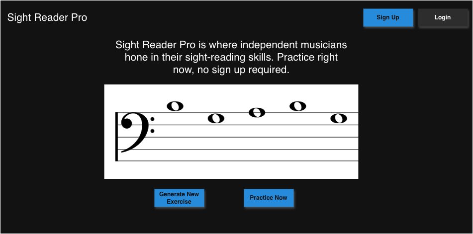
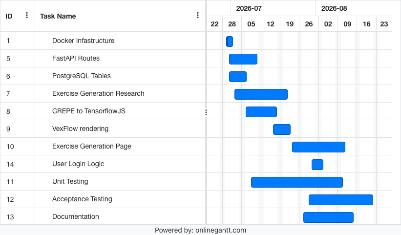

# Introduction
<!-- An introduction: this explains the project concept and motivation for the project (this can be based on your proposal). This must also state which project template you are using (max 1000 words). -->

*The template I am choosing is Artificial Intelligence Project Template 1: Orchestrating AI Models to Achieve a Goal.*

In music, there is a concept called sight reading. It involves being given a piece of sheet music and trying to play or sing it right away with little or no preparation. According to the National Association for Music Education, the ability to sight read music has many benefits including increased confidence, stronger foundations in rhythm and pitch, and less stress when it comes to learning new music pieces [@empowering].

## An overview

"Sight Reading Pro", the name of this project, will be an application where users can practice and master sight reading. Users will be able to use any instrument of their choosing, including voice, to practice their sight reading abilities.

{width=300px}

Sight Reading Pro will be a web based application, utilizing various state of the art machine learning models to generate music passages for users to practice their sight reading abilities. The user will get immediate feedback on attempts, including intonation (did they play the correct note?) and rhythm (did they play at the correct time?).

Users can choose whether they want to have an account or not. If they choose to have an account, they can keep track of all of the passages they've generated, and their recorded attempts and feedback on each passage.

Users with or without a login will be able to customize the complexity and difficulty of the generated passages using settings. Users will also be able to select between different styles of passages, such as classical or jazz.

## Why Would People Want This Project?

Personally, I've always wanted to get better at sight reading but haven't found any existing products on the market that make me stick with working through exercises. The generated exercises are often boring, and only target one music area at a time (i.e. advance rhythms, chords, harmony, etc).

The existing free projects on the market have limited instrument support, and have no way to track exercise history. The paid options are more focused on music education, instead of individual learning goals. The paid options are also out of reach to users that want to learn sight reading, but don't have the budget to do so.

My goals for the project are to make a free, individualized sight reading platform that can work with any instrument.

## Existing/Similar Projects

### Sight Reading Factory

{width=300px}

Sight Reading Factory[@sighta] is a platform for sight reading exercises mainly aimed towards educators. This platform supports ~30 instruments, and offers different difficulties of music passages to play. They offer generated music exercises for learners to practice with, getting feedback with each attempt at playing a passage.

#### Advantages

Sight Reading factory has a wide variety of features, including the ability to assess how well a user did on a given passage of music, and the ability to control how difficult generated passages are by limiting the note range, tempo, and rhythmic complexity. Sight Reading Factory supports both general audio/microphone input and MIDI. 

Sight reading factory allows you to keep track of what passages you have generated, all of the sight reading attempts you have made on a given passage, and it offers assessments on new blind passages. This product is the most robust with features that I have found.

#### Disadvantages

I believe the biggest disadvantage to Sight Reading Factory is the fact that it's a subscription, and starts at $45 per user per year. There's a free trial, but you have to enter credit card information in order to try it. 

Sight Reading factory supports 30 instruments, but has no generic option if your instrument is not supported. You must log in to do anything, which can be just enough friction for learners that want to try sight reading without committing to a product. This product is also heavily influenced by music educators, and a lot of the features are what you would expect to be in a classroom environment. For example, getting assigned passages to work on.

### sightreading.training

{width=300px}

sightreading.training[@sight] is a free and open source sight reading platform. It offers sight reading tools, and other tools for learning and playing music. 

#### Advantages

sightreading.training supports MIDI, or allows the user to play on a piano that's in the browser. Having a virtual piano is a cool idea, as it makes sight reading accessible to everyone, including those that don't have an instrument of their own. This website is also free, and you can get started practicing right away. Users have the ability to login and save settings for their sight reading passages, but not the passages themselves.

#### Disadvantages

sightreading.training only supports MIDI and the virtual piano. If you have an instrument that you can't plug into your computer, you can't use this application. There are no settings to change rhythmic complexity. All of the notes have the same length.

# Literature Review
<!-- A literature review: this is a revised version of the document that you submitted for your second peer review (max 2500 words). -->

## Exploring Sight Reading in Education

Understanding sight-reading, and how to improve this ability has been an area of study for over 100 years. One research study shows that aural-spatial skills (ear training) and technical proficiency skills were both essential to sight reading[@hayward2009relationships].

In more recent times, a review was done on AI-education research related to music education. It concludes that "AI is under-utilized for generation despite its potential for education"[@carnovalini2025personalized]. The music generation part of the literature review goes deeper into music generation related to music exercises for general technical improvement.

## Pitch Estimation and Tempo Estimation

There are lots of existing pre-trained models available that do different tasks related to music. This is an overview of the models I found most relevant to this project, and the models that I will test for usage in this project.

### CREPE

CREPE is a deep convolutional neural network that does pitch estimation [@kim2018crepe]. Given an audio file, such as a .wav or .mp3 file, CREPE will give a predicted frequency in hertz alongside a confidence score for every 10 milliseconds. Having a confidence interval allows for 

There is also a demo of CREPE[@crepea] that runs fully in the browser using Tensorflow JS (tfjs)[@tensorflowjs]. It shows real time pitch estimation based on microphone input. In regards to this project, being able to have real time pitch estimation would allow for immediate feedback on a music passage.

### TempoCNN

TempoCNN[@schreiber2018singlestep] is a group of Convolutional Neural Network (CNN) models that estimate a given audio file's tempo, measured in beats per minute (BPM). These modes were trained on datasets that included mainly ballroom dancing music, and electronic dance music. This paper does note that there is a lack of various genres of music, including jazz, classical or reggae, and believes that the models would perform better if they had found and included this kind of data.

For my project "Sight Reader Pro", I believe TempoCNN is a good candidate model for being able to automatically detect the tempo that the user's recording was played at, and also use it for giving feedback on a given passage.

## Music Generation

### Basic Pitch

Basic Pitch[@bittner2022lightweight] is a model built by spotify that takes in an audio file (.wav or .mp3), and returns a MIDI file containing either the single pitch (one instrument/voice) or multi pitch (multiple instruments/voices/notes). Basic Pitch works in the realm of "Automatic Music Transcription", an area of research used to automatically create symbolic representations of music.

I believe Basic Pitch is a good candidate model that I can use to create backing tracks, and be able to have them stored as midi files. This way the project can take advantage of technologies such as WebMIDI[@2026web] for playback of a generated passage.

### MusicGEN

In "Simple and Controllable Music Generation", Meta AI describes a Language Model called MusicGEN[@copet2024simple]. MusicGEN is capable of taking a text based input, and generating a full song. This model can also be prompted with an existing melody and a text prompt, and output a song based on the original melody.

This series of models is promising for offering customized backing tracks for generated sight reading exercises. The exercises could be tailored to include the correct genre of backing track.

While the music generated is really high quality, the models are also large and require a lot of compute. The smallest model in the MusicGEN model series contains 300 million parameters, and requires ~16gb of GPU RAM to run.

### NotaGen

NotaGen[@wang2025notagen] is a model that generates classical sheet music. The paper proposes a new "ClaMP-DPO" method for reinforcement learning, which increases musicality when compared to traditional human annotation or predefined rewards.

This model requires at least 8GB of GPU RAM to run the smallest model. One goal of "Sight Reader Pro" is to have low response times for any generative process. Because of the large compute requirements for NotaGEN, I don't believe it will be a good fit for the project.

# Design
<!-- A design: this is a revised version of the document that you submitted for your third peer review (max 2000 words). -->

*As stated in the intro, the template I am choosing is Artificial Intelligence Project Template 1: Orchestrating AI Models to Achieve a Goal.*

## Domain and Project Users

The goal of this project is to create a sight-reading web application that utilizes various machine learning models to create unique sight-reading exercises. The *target user* for this project is an independent musician that's looking to improve their sight-reading abilities, and is interested in a customized experience based on their instrument of choice, skill level and music genre of choice. The *domain* of this project could be considered to be music education, but I'm aiming for it to be specifically independent music education.

This project is not ideal for users just learning an instrument, as this application requires at least an elementary understanding of reading sheet music, and playing their instrument of choice.

## Design Overview

The designs below are what an minimum viable product for this project will look like. They have all of the bare minimum functionality, and nothing more.

### Home / Landing Page
{width=500px}

The home page will be a simple call to action to start practicing right now. The user can pick from generating another random exercise, or practice the one displayed right now. There will be no option to customize exercises from the home screen. If "practice now" is clicked, they will be taken to the main practice screen.

### Before Recording Exercise Attempt

{width=500px}

The exercise page before an attempt is very clean, only including two options: connect to an audio source and record an attempt. If the user selects the record, the record button will switch to a stop button. After the stop button is selected, the screen will update to the "after recording exercise attempt" screen. If the user doesn't have an audio source selected, they will not be able to record an attempt.

After I conduct more user interviews I will determine if there is a need for an audio upload option.

### After Recording Exercise Attempt

{width=500px}

This screen is extremely similar to the before exercise attempt screen, but with feedback added from the previous attempt. More feedback will be included based on settings selected, including tempo, rhythm accuracy, etc.

### Generate New Exercises

{width=500px}

In the mockup I have two settings to choose from, a difficulty slider and a genre selector. There will be more settings that I did not include in the mockup, such as:

- Tempo
- Key Signatures
- Melody Complexity (note type selectors)

### Exercise History

{width=500px}

This mockup shows the Exercise History screen. This screen has all of the exercises that the user has ever generated. The user has the ability to go to an exercise, or to delete it from the list. In this mockup I'm using cards to display each exercise that has been generated.

## Design Choices

<!-- TODO: Why did we make the choices we did? How will these choices best fufil the needs of the users? -->

### Good experience with or without an account

My main goal is to reduce friction in users trying out Sight Reader Pro. All of the core functionality will be in the exercise page if a user is logged in or if they're anonymous.

### Customizable Exercise Settings

The settings to generate sight-reading exercises will allow users to generate exercises that are specific to them. For example, I only would want to see bass clef exercises that have a jazzy theme. Each user will be able to "choose their own adventure" for what kind of sight-reading experience they want.

## Project Structure

### Frontend

The frontend will be a web application, and it will use the React[@react] library. Vexflow[@vexflowa] will be used for the music notation. TensorflowJS[@tensorflowjs] is going to be utilized to have CREPE[@crepe] served directly on the frontend for real-time pitch estimation. The frontend will utilize the backend API for the majority of the logic for the entire application. Jest[@jest] will be used for all frontend related testing.

### Backend

The backend API will be written in Python, and will use the FastAPI[@fastapi] library for all of the API calls. The backendAPI will make calls to the model-specific Docker[@docker] containers where the models are hosted/deployed.

Each model will be hosted in its own container, and will have a single FastAPI[@fastapi] endpoint for running inference on the model. The exact models that will be used for generating sight-reading exercises are still being researched.

PostgreSQL[@group2026postgresql] will be used as the database for the application, and will be in it's own container. PostgreSQL will be used for storing the data related to each exercise, including the settings used to generate it.

Testing of the backend logic will be done using PyTest[@pytest]

### Docker

Docker[@docker], and Docker Compose will be utilized to containerize the entire project. This way all of the dependencies for each part of the project will be isolated from one another. This is especially important for all of the models, which have different python versions and conflicting dependencies.

## Project Plan

## Testing/Evaluation Plan

### End-to-end

I will have a handful of end to end tests that ensure that the entire application is working as expected. I will have at least 10 pre-recorded audio samples that I will measure against exercises that have already been generated. The success criteria for these tests is 90%.

### User feedback

This project is going to use user feedback as the main success criteria. I will recruit musicians of different abilities to use the application, fill out a survey with their music related history (technical ability, etc) and to use the application at different phases during development. My goal is to get 5 musicians to use the application.

I will have questionnaires for each major feature release, so the main testing users can give relevant feedback for that feature, and the application as a whole.

# Feature Prototype
<!-- A feature prototype: this is the only new element of the submission, details below (max 1500 words). -->

## Proving out a note recognition model

I believe the hardest part of this project will be recognizing notes from any instrument, and then plotting them against the original exercise and checking for accuracy. For a basic prototype, I wanted to build a pipeline that takes in audio, and then creates a music engraving/sheet music based on what was played. 

### Iterating quickly with Gradio

To test out models quickly, I wanted to keep my "frontend" as close as possible to Python, where I would be testing various models. I've used Gradio[@abid2019gradio] at work in the past, and found its easy syntax for spinning up Python based web demos to be perfect. Gradio already has simple components like getting audio

### Utilizing the CREPE model

Installing the CREPE[@kim2018crepe] model to test out was simple, as it has a python library available on PIP[@crepeb]. The library allows the developer to choose between the different model sizes (tiny, small, medium etc), and allows for different "step sizes", or how often the given audio track will be sampled and have its frequency analyzed.

## Demo in action
{width=300px}

This demo allowed both a live audio recording, and the ability to upload a .wav or .mp3. I found the ability to upload an audio file nice for testing purposes, but I don't believe most users would end up using an upload feature.

The demo has the ability to playback the audio that was uploaded/recorded. This was super helpful when looking at the rendered sheet music that was based on the recording.

The CREPE[@kim2018crepe] model output contains a frequency in hertz, and a confidence interval. The model has a "step" parameter for how often it samples the audio file, and in this demo it's set at 10 milliseconds.

{width=300px}

To try and get a better understanding of the data that was coming out of the model, I plotted the predicted frequency and confidence markers on a graph. The red dots over the line graph indicate the model was at least 70% confident in that prediction.

As can be seen in the demo, there are a few outliers that have confidence marker, which means I probably need to increase the confidence threshold in the real application.

{width=300px}

The output was a simple bass clef with whatever notes I decided to play on my bass at that time. During some of my experiments it would plot a note I never played, usually stemming from sounds made while I was starting or stopping the recording. I believe that adjusting the confidence interval like I mentioned in the paragraph above will fix this.

## Evaluating the Feature

### What goes well

The CREPE[@kim2018crepe] model works really well. After playing around with the different model sizes and landing on the "small" one, I'm happy with how fast it was able to return results. It took longer to render the frequency plot than it did to process the audio file!

The python environment in general was very easy to prototype in, and make lots of changes quickly. I believe this is solid evidence for me sticking with python in the backend for all of the models and the backend API.

### What needs improvement

While lilypond works in the demo, it took forever to get set up and the rendered music engraving was average. It rendered an entire PDF, which had to be saved as a PNG, and then passed to Gradio[@abid2019gradio] for it to be rendered. In the future, I would like the python side to create only what's needed for the frontend to render the music engraving, saving the output in abc notation[@abc], or something similar.

As mentioned in above paragraphs, the confidence interval for the CREPE model needs to be adjusted so random background noise is not included in the eventual music engraving.

Now that the basic music notes that were played are being plotted, I want to add more information about the rhythm that was played. Using the TempoCNN[@schreiber2018singlestep] model, or something similar, I can get tempo related features from the same audio stream and use them to enhance my music engravings.

While Gradio[@abid2019gradio] was nice for a quick prototype, the framework is not flexible enough to deliver the final product. As outlined in the architecture area, the frontend will be switched to use the React[@react] framework. The music engraving will be moving to the frontend, and will be rendered using VexFlow[@vexflowa]. Having the frontend using javascript will also enable me to prototype more models that use Tensorflowjs[@tensorflowjs], where the models are hosted on the client's web browser.

\newpage
# Acknowledgements
- I'm grateful to my sister Anna, and my partner J for proof reading through this report too many times to count, and supporting me during stressful times.
- [Pandoc](https://pandoc.org/) was used to generate this report from a markdown file
- [Zotero](https://www.zotero.org/) was used to manage sources, and generate a BibTex file for references/citations
- [draw.io](https://www.drawio.com/) was used for all of the Sight Reader Pro mockups
- [Online Gantt](https://www.onlinegantt.com/#/gantt) for creating the gantt chart image

# References